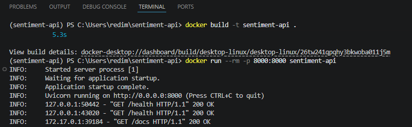
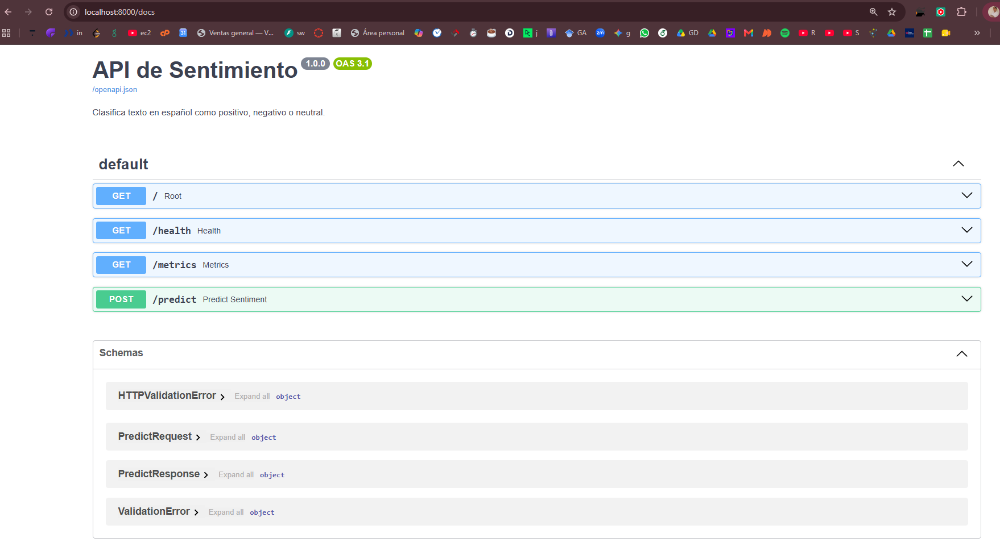
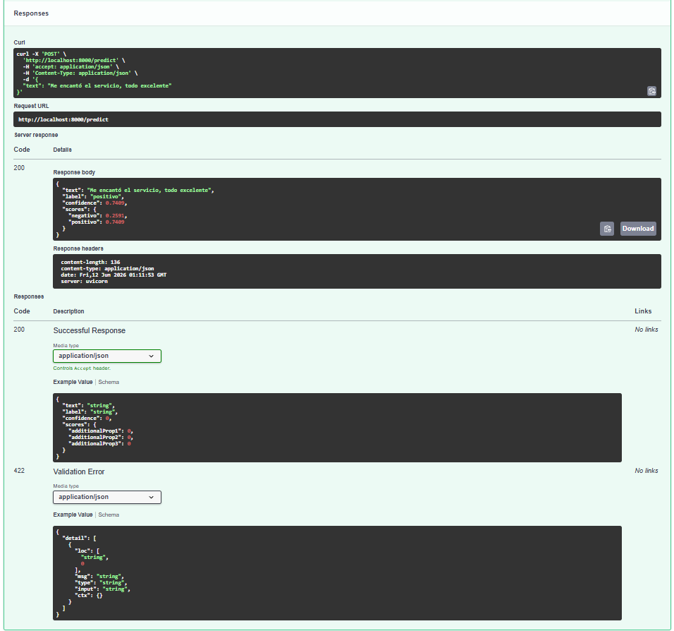
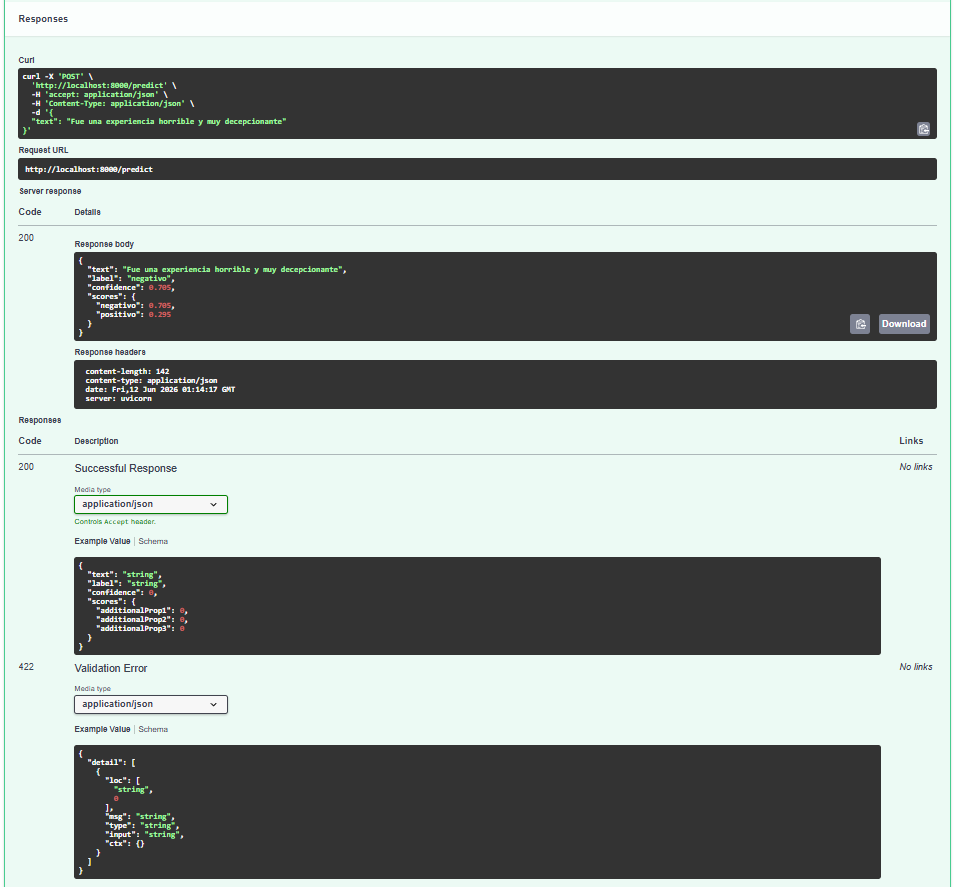
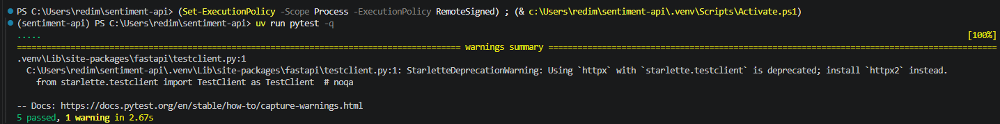
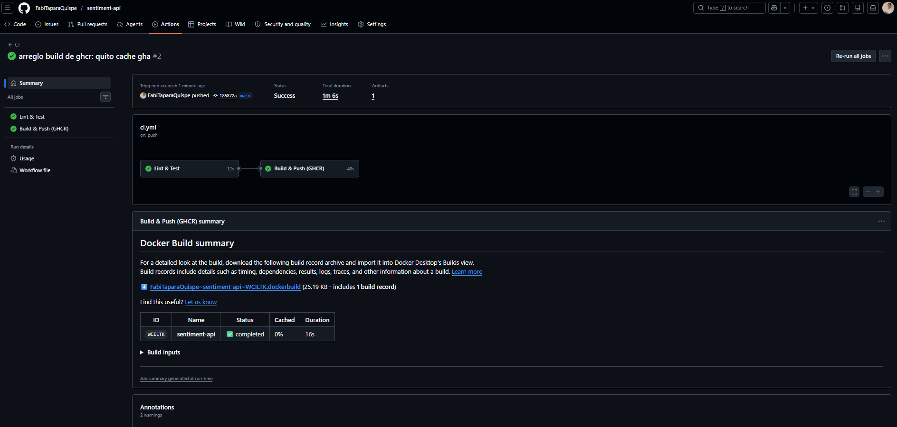

# API de análisis de sentimiento

Pequeña API de ML para el control del curso Modelos en Producción (UNI 2026).

Recibe un texto en español y devuelve si el sentimiento es positivo, negativo o
neutral, con la confianza del modelo.

El modelo es un TF-IDF (1-2 gramas, sin acentos) con regresión logística de
scikit-learn. No necesita API key: el modelo se entrena durante el build y queda
dentro de la imagen, así que funciona offline. Arranca con un solo `docker run`.

## Construir la imagen

```bash
docker build -t sentiment-api .
```

El modelo se entrena solo durante el build, no hay pasos extra.

## Correr la imagen

```bash
docker run --rm -p 8000:8000 sentiment-api
```

La API queda en `http://localhost:8000` y la documentación interactiva
(Swagger) en `http://localhost:8000/docs`.

## Ejemplo

Petición:

```bash
curl -X POST http://localhost:8000/predict \
  -H "Content-Type: application/json" \
  -d "{\"text\": \"Me encantó el servicio, todo excelente\"}"
```

Respuesta:

```json
{
  "text": "Me encantó el servicio, todo excelente",
  "label": "positivo",
  "confidence": 0.84,
  "scores": { "negativo": 0.16, "positivo": 0.84 }
}
```

Un ejemplo negativo:

```bash
curl -X POST http://localhost:8000/predict \
  -H "Content-Type: application/json" \
  -d "{\"text\": \"Fue una experiencia horrible y muy decepcionante\"}"
# -> {"label": "negativo", ...}
```

En Windows con PowerShell:

```powershell
Invoke-RestMethod -Uri http://localhost:8000/predict -Method Post `
  -ContentType "application/json" `
  -Body '{"text": "Me encantó el servicio, todo excelente"}'
```

## Endpoints

| Método | Ruta       | Descripción                          |
|--------|------------|--------------------------------------|
| GET    | `/`        | Información de la API                |
| GET    | `/health`  | Healthcheck                          |
| POST   | `/predict` | Clasifica un texto                   |
| GET    | `/metrics` | Contadores de peticiones             |
| GET    | `/docs`    | Swagger UI                           |

## Cargar la imagen desde un .tar

Si recibes la imagen como archivo en vez de un registro:

```bash
docker load -i sentiment-api.tar
docker run --rm -p 8000:8000 sentiment-api
```

Para generar ese .tar:

```bash
docker save sentiment-api -o sentiment-api.tar
```

## Correr en local (sin Docker)

Usa [uv](https://docs.astral.sh/uv/):

```bash
uv sync                      # instala dependencias (usa uv.lock)
uv run python train.py       # entrena el modelo
uv run ruff check .          # lint
uv run pytest -q             # tests
uv run uvicorn app.main:app --reload   # servidor local
```

## Estructura

```
sentiment-api/
├── app/
│   ├── main.py        # endpoints FastAPI
│   └── model.py       # entrenamiento, carga y predicción
├── data/
│   └── train.csv      # dataset en español
├── tests/
│   └── test_api.py    # tests de la API
├── train.py           # script de entrenamiento
├── Dockerfile         # multi-stage, base slim, uv + lockfile, usuario no-root
├── pyproject.toml
├── uv.lock
└── .github/workflows/ci.yml   # CI: lint + test + build/push a GHCR
```

## Evidencias

Capturas de que la imagen arranca y el modelo responde bien.

La imagen arranca con un solo `docker run`:



Documentación interactiva (Swagger):



Texto positivo:



Texto negativo:



Tests y CI:




## Notas

El Dockerfile es multi-stage sobre `python:3.12-slim`, instala dependencias con
uv y el lockfile, ordena las capas para cachear y corre como usuario no-root con
un HEALTHCHECK. El CI de GitHub Actions hace lint con ruff, tests con pytest y
build/push de la imagen a GHCR con tag por SHA.

El dataset es pequeño y didáctico. Para mejorar la precisión basta con ampliar
`data/train.csv` y reconstruir la imagen.
